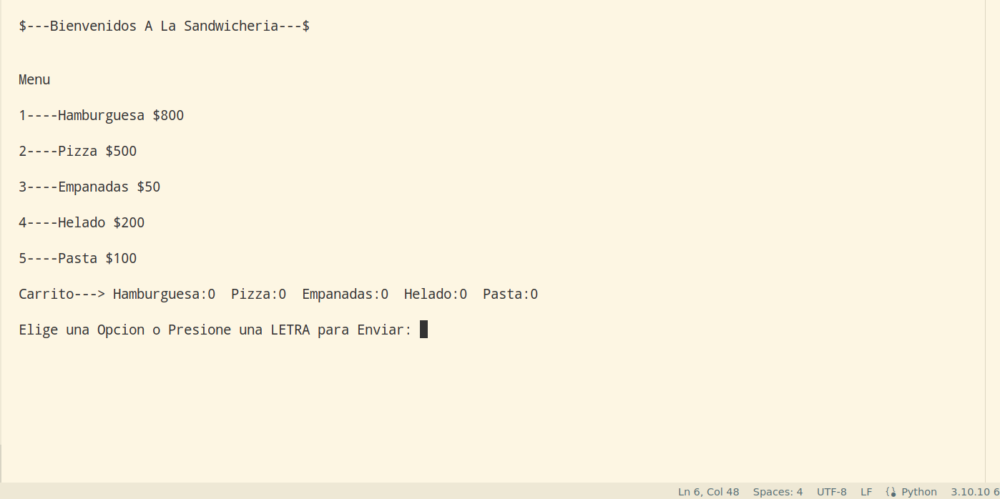
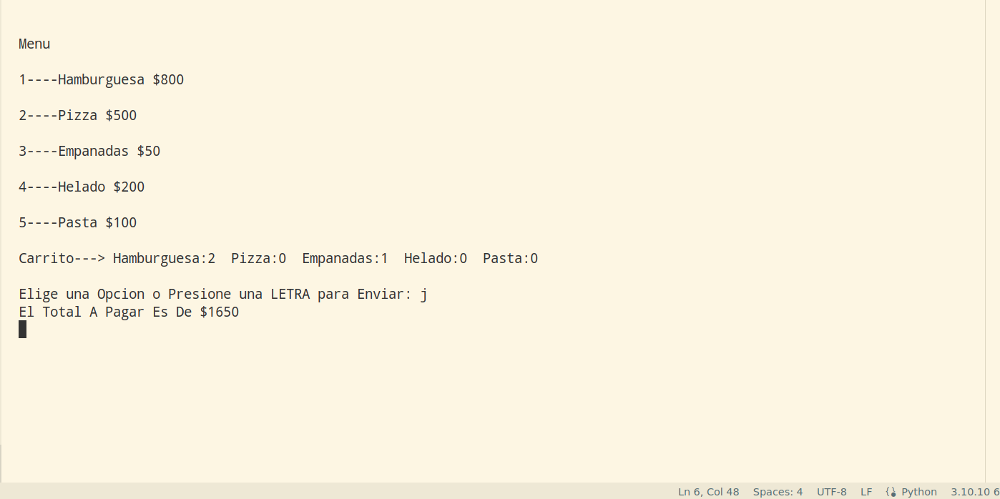

<h1>InteractiveMenu-CLI</h1>

<h2>Introduction</h2>

My very first python proyect, there are two versions beta_0.01 and beta_0.02, the objective is  learn about modularity and python classes.  It is a fastfood interactive menu, where you can choose between different options, you can see your selection in the shopping cart, and then it shows the total to pay. 
The version beta_0.02 is easily scalable.

<h2>Run it</h2>
To run it just execute <b>main.py</b>, it works for both versions.

<h3>Some screenshots</h3>

